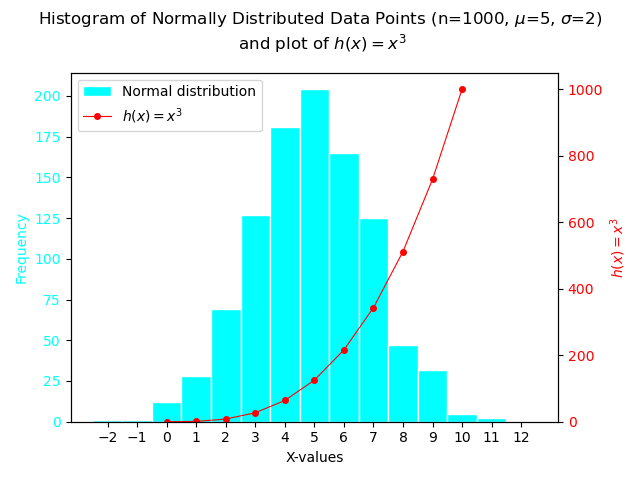

# Programming and Scripting Weekly Tasks
author: Susan Collins

Description of this repo: A collection of submitted exercises for the Programming and Scriping Module, part of The Higher Diploma in Data Analytics course at the Atlantic Technological University, Ireland, Spring 2025.

 - Developed using python v3.12.7

## Week 02 Task: bank.py
This program will prompt the user and read in two money amounts (in cent.) The program will then:
1. Add the two amounts
2. Print out the answer in a human readable format, with a euro sign and decimal point between the euro and cent of the amount 

## Week 03 Task: accounts.py
This program reads in an alpha-numeric account number, and outputs the account number with only the last 4 digits showing (and the preceding digits replaced with Xs).
- If the account number has 4 digits or fewer, it is output without obfuscation.

## Week 04 Task: collatz.py
This program asks the user to input any positive integer, then repeats two simple arithmetic operations on this number, after the manner of the Collatz conjecture. If the number is even it is divided by two, if it is odd it is multiplied by three and 1 is added. The program ends if/when the current value reaches 1. 
- this program performs some simple checks on the user input; if the input is not a positive integer, it requests another input.
- future development proposed: (1) allow user to enter a special string to stop the program? (2) count the number of steps the integer takes to reach 1? (3) compare this result to nearby integers?

## Week 05 Task: weekday.py
This program outputs whether or not today (at the time of running) is a weekday. There is no user input.
I used the isoweekday() function in this program because it's my personal preference, and also because of my abiding love and respect for the [International Organization for Standardization](https://www.iso.org/home.html). It also made the coding easier.

Expected output if called on Monday through Friday:
```
$ python weekday.py 
Yes, unfortunately today is a weekday.
```
Expected output if called on Saturday or Sunday:
```
$ python weekday.py 
It is the weekend, yay!
```
------------------------------------------------------------------------
## Week 06 Task: squareroot.py
This program takes a positive floating-point number as input and outputs an approximation of its square root, using a custom sqrt() function, as an exercise in creating functions. 
- The custom sqrt() function uses Newton's method of finding square roots. This is an iterative process where each step gives a result that is closer to the true answer. Given a positive number $a$, for which you want to find the square root, and given a starting approximate value of the root $x_n$, the iteration is given by:

$$
x_{n+1}= \frac{1}{2} \left({x_n + \frac{a}{x_n}}\right)
$$

 - Stopping the loop: Initially I ran the interation loop 100 times, but this is often unnecessary. Ideally I would like the loop to stop when it has found the correct answer, but because the comparison of floats can be inexact, the loop may not ever stop. So, I added a parameter to the sqrt() function that indicates how close to the true answer the calculated answer must be to be considered 'correct' and end the loop. 

- considerations: how to get the start value?

### Research and Sources

Comparing Floats: https://www.geeksforgeeks.org/comparing-floating-points-number-for-almost-equality-in-python/

Newton's method: https://en.wikipedia.org/wiki/Newton%27s_method#Examples

LaTeX formatting references: https://code.visualstudio.com/docs/languages/markdown and https://www.upyesp.org/posts/makrdown-vscode-math-notation/

---------------------------------------------------------------
## Week 07 Task: es.py
**Please Note: I started developing this program as count_es.py, and after the first commit, I renamed it to es.py. Unfortunately, GitHub sees these as two files with separate histories.**
>Instructions: Write a program that reads in a text file and outputs the number of e's it contains. Think about what is being asked here, document any assumptions you are making.  
>The program should take the filename from an argument on the command line. I have not shown you how to do this, you need to look it up.  
>Marks will be given for dealing with errors eg no argument, filename that does not exist, or is not a text file.

### Additional features 
- I added an option to specify a different character to be counted on the command-line, 
as `$ python es.py <FILE.TXT> <optional letter>`. Only a one-character argument will be accepted.
- This program will count both lowercase and uppercase instances of e (or any othey letter specified.)

### Expected Output
```
# Calling this program with a valid text file
$ python es.py pride_and_prejudice.txt
> filename is pride_and_prejudice.txt
> Finished - there are 74451 instance(s) of the letter e in the file pride_and_prejudice.txt 

# Calling this program with a valid text file and specifying a single character to count
$ python es.py pride_and_prejudice.txt t
> filename is pride_and_prejudice.txt
> Finished - there are 50837 instance(s) of the letter t in the file pride_and_prejudice.txt 

# Calling this program with a valid text file and specifying multiple letters to count
$ python es.py pride_and_prejudice.txt xyzzy
> filename is pride_and_prejudice.txt
> This program can only count single letters, and you asked it to count xyzzy. 
> Goodbye.

# Calling this program with no file specified prints help information
$ python es.py
> This is a program to count the instances of the letter 'e' in a text file. 
> You may choose a different letter to count by specifying it on the command line.
> This program should be called as: $ python es.py <FILE.TXT> <optional letter>

# Calling this program with a file that does not exist prints a relevant text message
$ pythom es.py file_not_existing.txt
> filename is file_not_existing.txt
> Error! The file file_not_existing.txt does not exist.

# Calling this program with a file that is not a text file prints a relevant text message
$ python es.py testbin.bin
> filename is testbin.bin
> Error! The file testbin.bin is not a text file.

```

### Research and Sources
Txt files for development were downloaded from [Project Gutenberg](www.gutenberg.org), these text files have been added to `.gitignore` so they will not be pushed to GitHub.

Tutorial on passing command-line arguments to a Python program: https://www.tutorialspoint.com/python/python_command_line_arguments.htm  
Terminating a program (sys.exit()): https://stackoverflow.com/questions/73663/how-do-i-terminate-a-script

Error handling: I found the correct names of exceptions for this program by trial and error. 
- importing a module that had not been installed throws a `ModuleNotFoundError`.
- passing a filename for which the file does not exist throws a `FileNotFoundError`.
- attempting to open a binary file as a text file throws a `UnicodeDecodeError`.  

Error Handling Sources:  
W3schools on try/except/else/finally: https://www.w3schools.com/python/python_try_except.asp#gsc.tab=0   
W3schools list of Python built-in exceptions: https://www.w3schools.com/python/python_ref_exceptions.asp   

---------------------------------------------------------------
## Week 08 Task: plottask.py
>Instructions: Write a program called plottask.py that displays:
>    a histogram of a normal distribution of a 1000 values with a mean of 5 and standard deviation of 2, 
>   and a plot of the function  h(x)=x3 in the range 0 to 10, 
>on the one set of axes.
>Some marks will be given for making the plot look nice (legend etc).
>Please put a copy of the image of the plot (.png file) into the repository

### Additional features
- I dynamcally set my histogram bins to be of size 1 and centred on each integer value. Code to generate a bin limit range using `numpy.arange()` was suggested by [this StackOverflow answer](https://stackoverflow.com/a/12176344).
- Added secondary y-axis for the cubic function. As the max value of the histogram is approx. 200 and the value of the cubic funcion is 1000 at x-10, they do not display well on the same vertical scale. 

### Expected Output
This program generates a PNG image showing the requested histogram and cube function.


### Research performed for this task
**Using numpy.random.Generator().normal**  
The NumPy documentation states that the RandomState function used in lectures has been superseded by the Generator method.
The method to generate the normally-distributed datapoints for this program was taken from https://numpy.org/doc/stable/reference/random/generated/numpy.random.Generator.normal.html

**Plotting a second function on the same plot using a secondary y-axis**  
I followed this worked example, which let me create a twinned second Axes for the plot:
[MatPlotLib.org:Plots with different scales](https://matplotlib.org/stable/gallery/subplots_axes_and_figures/two_scales.html)  
Plotting a combined legend for both functions required calling `figure.legend()` ([documented here](https://matplotlib.org/stable/api/_as_gen/matplotlib.figure.Figure.legend.html)), and using a `bbox_to_anchor` parameter to position the legend properly (method taken from [StackOverflow comment](https://stackoverflow.com/a/47370214))

**Superscript on plot axis labels**   
I wanted to display x^3 as x³ in my plot title and labels.  
A [GeeksForGeeks post](https://www.geeksforgeeks.org/how-to-print-superscript-and-subscript-in-python/) offered a way to insert Unicode directly into an f-string. This would work if I was using a fixed power of x, but I am using the variable 'index' to represent the power and I would like the plot title to change dynamically if this variable changes. 
The MathPlotLib documentation states that MathPlotLib supports a subset of TeX markup called [MathText](https://matplotlib.org/stable/users/explain/text/mathtext.html), so I can use that to apply superscript formatting to the variable value in my chart title.  
With index=3, `title="plot of $y=x^{index}$"`  renders as: plot of $y=x^3$

Note that I haven't had to use curly braces in the TeX expression itself; if I did, I would have to double-brace to avoid Python interpreting them as f-string variables. Through trial-and-error, I find that:  
With index=3, `title="plot of $y=x^{{5+{index}}}$"` renders as: plot of $y=x^{5+3}$

**Superscript in markdown**  
I then had to research a way to insert x³ this README.md file!  
Pure markdown does not have a superscript or subscript syntax.   
This [StackOverflow post](https://stackoverflow.com/questions/15155778/superscript-in-markdown-github-flavored) suggested some other solutions: 
1. Embedded HTML tags: `x<sup>3</sup>` displays as x<sup>3</sup> 
2. Embedded LaTeX: `$x^{3}$`  displays as $x^{3}$ 
3. Directly typing x³ as Unicode works, and leaves the raw Markdown file more readable.

----------------------------------------------------------
# General Research / Reading / Notes

## Research notes on Python style conventions
The [PEP 8 – Style Guide for Python Code](https://peps.python.org/pep-0008/) outlines coding conventions for the Python standard library, which are commonly adopted as general style standards. In this repo I am adhering to:
- "Limit all lines to a maximum of 79 characters." (avoids the default wrapping in most tools)
- "Function names should be lowercase, with words separated by underscores as necessary to improve readability." 

### Other reading on this topic
[Python Morsels: Breaking up long lines of code in Python](https://www.pythonmorsels.com/breaking-long-lines-code-python/)  
[GeeksForGeeks: Python – Multi-Line Statements](https://www.geeksforgeeks.org/python-multi-line-statements/)

## Research notes on git commit messages
I have not consistently used any particular git commit message convention in these weekly tasks, but I am slowly starting to incorporate the advice from the sources below. 

There are many, **many** articles and blog posts on what comprises a 'good' Git commit message:
 - [freeCodeCamp(2019): How to Write Good Commit Messages: A Practical Git Guide](https://www.freecodecamp.org/news/writing-good-commit-messages-a-practical-guide/)
 - [Kelvin Romero @Medium(2023): Writing good commit messages](https://kelvinromero.medium.com/writing-good-commit-messages-527679b1babb)
 - [Hashnode(2019): Which commit message convention do you use at work?](https://hashnode.com/post/which-commit-message-convention-do-you-use-at-work-ck3e4jbdd00zyo4s1h7mc7e0g)
 - [Tim Pope(2008): A Note About Git Commit Messages](https://tbaggery.com/2008/04/19/a-note-about-git-commit-messages.html)

Common advice from these writers include:
 - separate subject line (concise, approx 50 characters) and optional body text (longer description)
 - ["Atomic Commits"](https://sparkbox.com/foundry/atomic_commits_with_git), i.e. each commit repesents one small, complete, independent chunk of work. This chunk should be large enough to contain a complete change, ideally with the codebase working both before and after the change, and also small enough that it can be described/understood easily and it represents only one change. If multiple changes are represented in one commit, it would be more difficult to track the history of the changes or their separate effects on the code. 
  - Using the imperative tense of verbs. This convention seems to be a combination of (a) in English, verbs in this tense are usually shorter than in other tenses, (b) Git itself uses the imperative when it creates messages, so you might as well match. 

 Many people explicitly follow the [Conventional Commits](https://www.conventionalcommits.org/en/about/) standard. This is a very detailed standard which is designed to allow the use of automated tools to parse and analyse the commit history. The full standard is not useful for me at this time, but one prominent feature which I have begun to use is the inclusion of a keyword at the start of each commit message to indicate the type of change, e.g.:
 - feat: add a new feature
 - fix: fix a bug
 - docu: amend documentation

 This is useful when looking back at past changes in the log, and it also reinforces the practice of only doing one type of change in each commit. 
